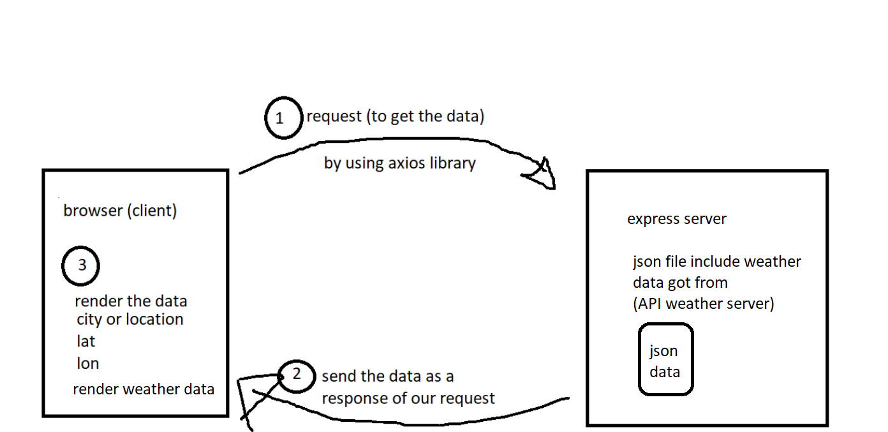

# city-explorer-api

**Author**: Your Name Goes Here
**Version**: 1.0.0 (increment the patch/fix version number if you make more commits past your first submission)

## Overview
<!-- Provide a high level overview of what this application is and why you are building it, beyond the fact that it's an assignment for this class. (i.e. What's your problem domain?) -->
the user should enter any city name to show him a static map , weather for many days and movies for entered city .
## Getting Started
<!-- What are the steps that a user must take in order to build this app on their own machine and get it running? -->
First should has our URL to run it on his maschine , and then input the area or any place that want and click on
Explore! button and then the data regard to lacation and weather will be rendered on his page .

## Architecture
<!-- Provide a detailed description of the application design. What technologies (languages, libraries, etc) you're using, and any other relevant design information. -->
express library , Json data , herouku .

## Change Log
<!-- Use this area to document the iterative changes made to your application as each feature is successfully implemented. Use time stamps. Here's an example:

01-01-2001 4:59pm - Application now has a fully-functional express server, with a GET route for the location resource. -->
15-6-2021 our website has an input field ready to use for user to get him the location and weather data . 
19-6-2021 our website has an input field ready to use for user to get him the location ,weather data and a set of movie. 

## Credit and Collaborations
<!-- Give credit (and a link) to other people or resources that helped you build this application. -->

## web request-response cycle

Name of feature: build our API server

Estimate of time needed to complete: 4 hours

Start time: 2:00pm (14-6-2021)

Finish time: 2:11pm (15-6-2021)

Actual time needed to complete: total time 6 hours

Name of feature: dara storing

Estimate of time needed to complete: 1 hour

Start time: 1:00pm 

Finish time: 3:11pm 

Actual time needed to complete: 2:11 hours 